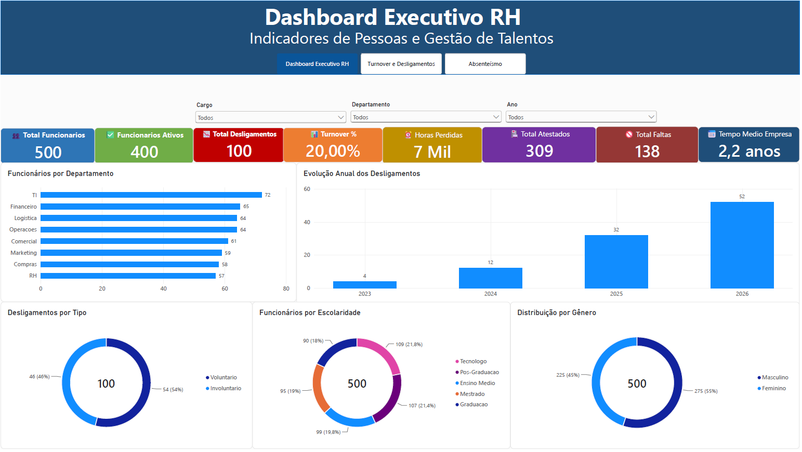
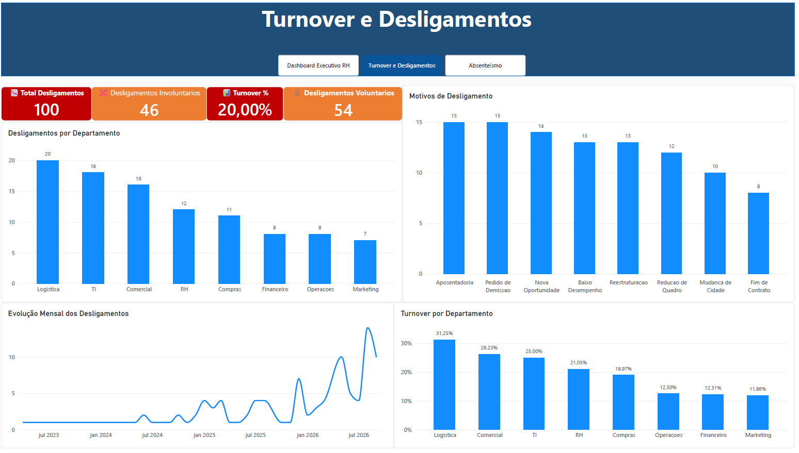
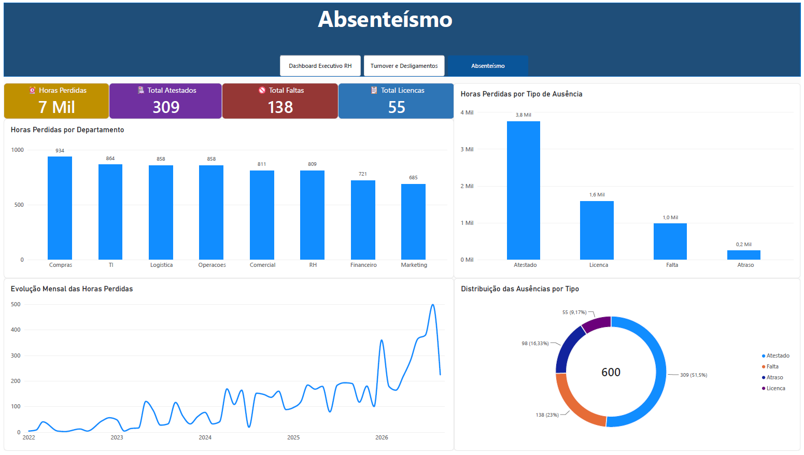

# 👥 Dashboard de Recursos Humanos (RH)

Dashboard desenvolvido em Power BI com foco em indicadores de Recursos Humanos, Turnover e Absenteísmo.

## 🚀 Tecnologias Utilizadas

- Power BI
- DAX
- Power Query
- Python
- Excel

## 📊 Páginas do Dashboard

## Dashboard Executivo RH

  
  
## Turnover e Desligamentos

  

## Absenteísmo

  

## Arquivo do Projeto

📄Dashboard_RH.pdf
