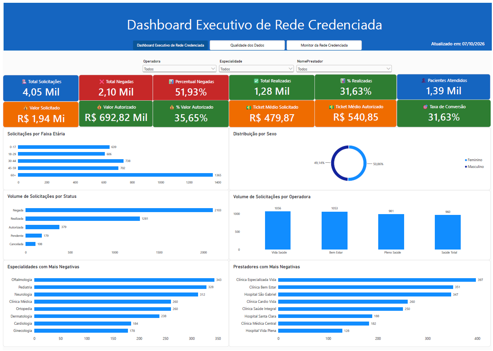

# 🏥 Dashboard de Rede Credenciada

Projeto desenvolvido em Power BI para monitoramento operacional, financeiro, qualidade dos dados e gestão da rede credenciada de uma operadora de saúde.

O projeto contempla todo o ciclo de desenvolvimento analítico, incluindo geração de dados, tratamento, modelagem dimensional, criação de indicadores em DAX e desenvolvimento de dashboards executivos.

---

## 🎯 Objetivo

Disponibilizar uma visão integrada da operação da rede credenciada, permitindo analisar:

- Desempenho operacional das solicitações
- Indicadores financeiros
- Qualidade dos dados
- Estrutura da rede credenciada
- Cobertura por operadora
- Distribuição de médicos e especialidades

---

## 📂 Documentação do Projeto

📄 **Relatório Completo**

Dashboard-Rede-Credenciada.pdf

---

## 🛠️ Tecnologias Utilizadas

- Power BI
- Power Query
- DAX
- Python
- Excel
- Modelagem Dimensional

---

## 📈 Página 1 - Dashboard Executivo

Visão consolidada dos indicadores operacionais, financeiros e assistenciais.

### Principais análises

- Total de Solicitações
- Total de Negadas
- Percentual de Negativas
- Total de Realizadas
- Taxa de Conversão
- Valor Solicitado
- Valor Autorizado
- Ticket Médio
- Perfil dos Pacientes
- Especialidades com Mais Negativas
- Prestadores com Mais Negativas

---

## 📋 Página 2 - Monitor de Qualidade dos Dados

Visão dedicada à governança, integridade e qualidade das informações utilizadas pela operação.

### Principais análises

- CPFs Ausentes
- CPFs Duplicados
- CNPJs Ausentes
- CNPJs Duplicados
- CRMs Ausentes
- CRMs Duplicados
- Motivos de Negativa Ausentes
- Homônimos Legítimos
- Distribuição dos Problemas
- Problemas por Entidade

imagens/pagina2-monitor-qualidade.png

---

## 🏥 Página 3 - Monitor da Rede Credenciada

Análise estrutural da rede credenciada e distribuição dos recursos assistenciais.

### Principais análises

- Total de Prestadores Credenciados
- Total de Médicos Credenciados
- Total de Especialidades
- Total de Planos
- Distribuição de Médicos por Especialidade
- Médicos Vinculados por Prestador
- Participação dos Vínculos por Operadora
- Vínculos Credenciados por Operadora
- Vínculos Credenciados por Especialidade

imagens/pagina3-monitor-rede.png

---

## 📊 Principais Conceitos Aplicados

- Modelagem Star Schema
- Tabelas Fato e Dimensão
- Tabelas Ponte (Bridge Tables)
- Medidas e KPIs em DAX
- Tratamento de Dados com Power Query
- Qualidade e Governança de Dados
- Storytelling com Dados
- Dashboards Executivos

---

## ✅ Resultados do Projeto

O projeto permitiu consolidar diferentes visões de negócio em um único modelo analítico:

- Operação Assistencial
- Indicadores Financeiros
- Qualidade dos Dados
- Governança da Informação
- Monitoramento da Rede Credenciada

---

## 📌 Observação

Os dados utilizados neste projeto foram gerados para fins educacionais e de portfólio, preservando a confidencialidade de informações reais.
